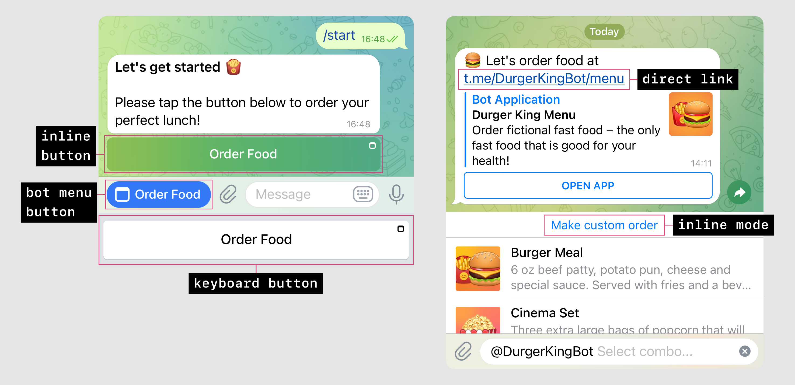

# Squizme
Squeeze your brain with some math quizzes on Telegram App.

`@squizme_bot`: a Mini App presenting a quiz about daily math use cases. The user interacts with a random quiz, the app presents a feedback answer, and in the end, presents the results.
The user can also interact with the bot by typing `/curiosity` and the bot answers random math curiosity.

## TL;DR;
To set up a Mini App on Telegram you will need:
1. A **web server** serving your Mini App (Vercel, GitHub)
2. A **Telegram bot** created with `@BotFather` on Telegram App
3. A **backend end server for Telegram bot** for the bot commands (AWS)

To *locally* set up a Mini App on Telegram you will need:
1. A **web server** running on your machine
2. A **Telegram bot** created with `@BotFather` on Telegram App
3. A **localhost exposer** to allow Telegram access your localhost
4. A **backend end server for Telegram bot** running on your machine

`BotFather` useful commands:
- `/help`
- `/editapp`
- `/setmenubutton`: sets the button on the chat. This feature allows access to **more features**, such as basic user information (as I use here the name).

This Mini Apps is launched from the Menu Button (bot menu button) and have one bot command.


# Setup this Mini App locally
The following steps will allow you to run this Mini App on your local server (localhost) and at the same time access it on the Telegram App (test environment)

### 1. Clone the repo
```
git clone git@github.com:MaisaMilena/telegram-math-quiz.git
```

### 2. Create a web server (open a new terminal - this will keep running): 
```
cd telegram-math-quiz/MiniApp
npm start
```
This will set the project, start the web server, and open the web application in your browser on `http://localhost:3000/`   

### 3. Expose your localhost (open a new terminal - this will keep running)
I suggest using [ngrok](https://ngrok.com/docs/getting-started/) to allow your localhost be accessible on the internet, a requirement to run Mini Apps locally.  
3.1 download ngrok  
3.2 connect your ngrok account  
3.3 then run:
```
ngrok http 3000
```


Doing this, you would be able to access the Mini App from any device using the ngrok URL.

# Create a Telegram test env
## Install the Telegram Beta Version (macOS)
1. Download and launch the Beta Version of Telegram macOS.
2. Quickly click 5 times on the Settings icon to open the debug menu and enable “Debug Mini Apps”.
Reference: https://core.telegram.org/bots/webapps#debug-mode-for-mini-apps

## Create a Test Account
A **test account** allows access to the test environment of Telegram. It is completely separate from the main environment where you have your real account. You will need to create a new user account:
```
- iOS: tap 10 times on the Settings icon > Accounts > Login to another account > Test.
- Telegram Desktop: open ☰ Settings > Shift + Alt + Right click ‘Add Account’ and select ‘Test Server’.
- macOS: click the Settings icon 10 times to open the Debug Menu, ⌘ + click ‘Add Account’ and log in via phone number.
```
Reference: https://core.telegram.org/bots/webapps#using-bots-in-the-test-environment

# Create a Telegram Bot (backend)
Talk to `BotFather`, type `/help`, and follow the instructions to create a new bot.  
Check the [documentation](https://core.telegram.org/bots#how-do-i-create-a-bot).

Use the `/setcommands` and type: `curiosity - Get a random curiosity about math`. You must tell the BotFather what commands are available. These commands responses are handled in `/bot/commands.js`.

To run it:
```
cd bot
node index.js
```

> Note: it runs by default in port 4000. It cannot be the same port as the Mini App.

You may face **several** `FetchError: request to https://api.telegram.org/<token>/getMe failed, reason: Socket connection timeout` for test and production, but keep trying and eventually it will work.

# Create a Telegram Mini App (frontend)
Talk to `BotFather`, type `/help`, and follow the instructions to create a new Mini App (Web App).
A list of commands will appear. Follow the instructions of `/newapp` to create a new app.

`BotFather` will ask you: `Now please send me the Web App URL that will be opened when users follow a web app direct link.`  

This URL must be a valid URL exposed on the internet. But you will start developing on your localhost, how to setup that?

# Tell `BotFather` the ngrok URL to finish the Mini App creation
Pay attention that every time you run the ngrok it will be a different URL and you will need to run `/editApp` and `/setmenubutton` to edit it.

# Notes:
1. I highly recommend creating the Mini App on localhost and only after that configuring the Mini App to test it.
2. `Socket connection timeout` may delay your progress. Is not related to Telegraf. I'm still trying to find out how to diminish this behavior. Suggestions are welcome.
3. There is a feature to be implemented: send the results from the quiz to the chat. Can you make it work? 😬
4. Happy coding!

Some cool projects that help me understand the Mini Apps:
- [TheCymond - Telegram Web App](https://github.com/TheCymond/Telegram_Web_App)
- Example of [Mini App](https://github.com/revenkroz/telegram-web-app-bot-example) on a single HTML file